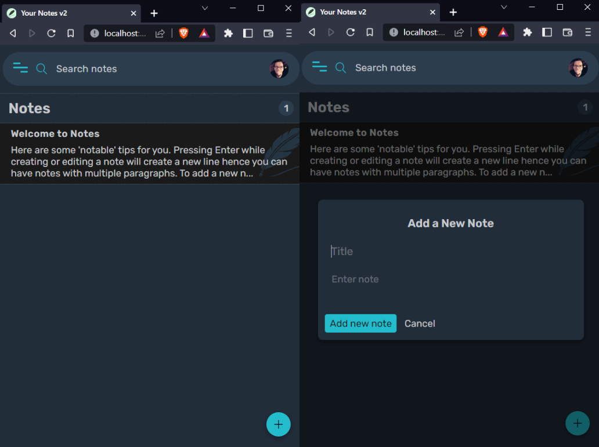
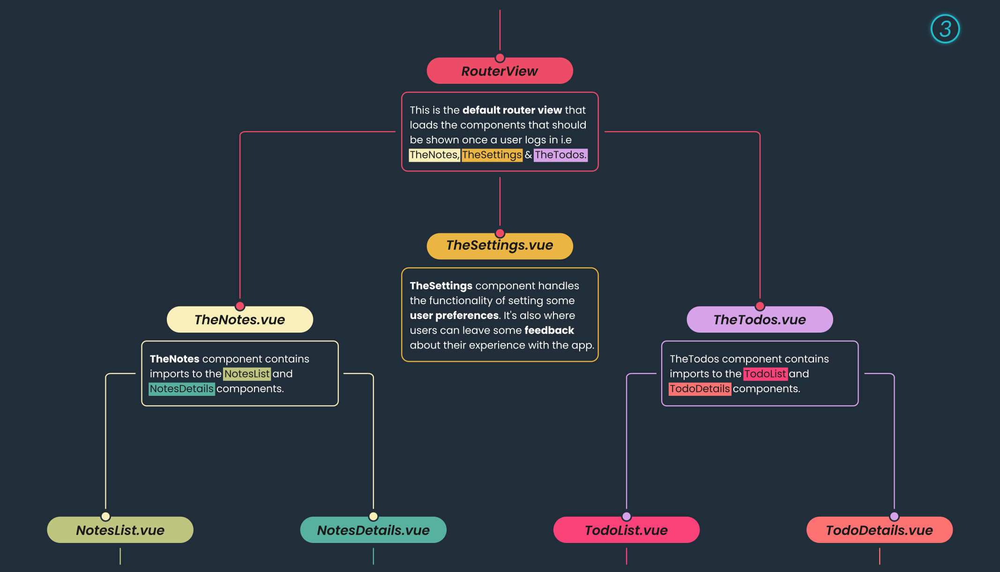

# Your Notes v2

This is a challenge I designed to help me practice my skills with the [Vue.js](https://v3.vuejs.org) framework.

<!-- Note that the Table of contents links don't work offline because
    of the use of emojis. They do however work online on GitHub

    https://github.com/thlorenz/anchor-markdown-header/issues/36
-->

## Table of contents 📖

- [Overview](#overview-)
  - [About the challenge](#about-the-challenge-)
  - [Screenshots](#screenshots-)
  - [Links](#links-)
- [My process](#my-process-gear)
  - [Built with](#built-with-hammer_and_wrench-pencil-triangular_ruler)
  - [What I learned](#what-i-learned-)
  - [Continued development](#continued-development-stopwatch)
  - [Useful resources](#useful-resources-)
- [Author](#author-)

## Overview 🔎

---

### About the challenge ❔

The challenge aims to test the developer's skill in:

- State management with `vuex`
- Handling user authentication with Firebase's Authentication service
- Handling storage of user data with Firebase's Cloud Firestore
- Implementing elements of progressive web applications
- Handling transitions the Vue way with the `transition` and `transition-group` components
- Animating routes
- Use of the `slots` Vue feature

 

### Screenshots 📷

---

Screenshot of the **included** design file.

- It shows a general view of the page designs.

---

 

Screenshot of the **included** design file.

- It shows the full view of the page designs.

---

 

Screenshot of the **included** design file.

- It shows page designs for the _purplish_ and _bluetiful_ themes.

---

 

Screenshot of the **included** design file.

- It shows the design for the **Notes** page with a note selected for viewing.

---

 

Screenshot of the **included** design file.

- It shows the design for the **Todos** page with a todo selected for viewing.
- It also shows some of the attached functionality for todo tasks.

---

 

Screenshot of the **included** design file.

- It shows the design for the **Todos** page with the _purplish_ theme selected.
- It also shows a todo task that has been opened for editing.

---

 

Screenshot of the **included** design file.

- It shows the design for the **Todos** page with the _bluetiful_ theme selected (_Psst! This happens to be my favorite theme_ 😉).
- It also shows a welcome todo that contains some useful tips.

---

 

Screenshot of the **Todos** page running on my **local development server**.

- It shows the loading screen while user data is being fetched.

---

 

Screenshot of the **Notes** page running on my **local development server**.

- It shows the sidebar minified as part of the responsive nature of the page.
- It also shows how the sidebar uses custom tooltips for a better user experience (_bottom-left_).

---

 

Screenshots of the **Notes** page running on my **local development server**.

- It shows the how the notes page looks on small screens.
- It also shows a modal for creating a new note.

---

 

Screenshot of the **Notes** page running on my **local development server**.

- It shows one of the many notifications that are available (_bottom-left_). The current notification shows up when a user deletes a note or a todo. I thought it would be funny to include [textfaces](https://textfac.es) and the textface on this particular notification looks like someone's throwing out something 😄

---

 

Screenshot of the **Notes** page running on my **local development server**.

- Who said you can't have fun while programming? This particular screenshot shows one of the errors that might occur when trying to communicate with **Firestore**. However, it is highly unlikely that a user will ever experience this type of error, unless they are dabbling in the **source code**. Hence, why I dubbed the error an '**_Epic Bug_**' 😅

---

 

Screenshot of the **Todos** page running on my **local development server**.

- I wanted to add something special for users of **Your Notes v2** - Any user that signs up to the site with an **Email** and **Password** gets to have a really cool, randomly generated **avatar** for their profile (_top-right_).
- As for user's who choose to sign up with **Google**, the profile photo from their Google account, if any, would be used instead. However, if they haven't set any profile photo, they too would get an **avatar** generated for them. #MadeWith🧡

---

 

Screenshots of the **App Tree**.

- They show an overview of the components, how they relate to each other and also describes some of the attached functionality.

 

### Links 🔗

- Live Site URL: [Your Notes v2](https://allankirui.github.io/your-notes-v2/)

 

## My process :gear:

---

I was actually reading a newspaper when the idea of creating a grid layout resembling the front page of a newspaper came to me 😅

 

### Built with :hammer_and_wrench: :pencil: :triangular_ruler:

- HTML5
- CSS Flexbox
- CSS Grid
- SASS
- [Inkscape](https://inkscape.org) - Inkscape: Open Source Scalable Vector Graphics Editor

 

### What I learned 🎓

Plenty of CSS Grid and how to apply it to layouts that are more suitable for Grid.

 

### Continued development :stopwatch:

Going forward, I feel much more confident using CSS Grid in projects.

 

### Useful resources 💎

- Ahmed Karimzade
- WebAim accessibility checker
- Forge icons
- CSS box shadows
- Text faces
  -Firebase
- Email.js
- Dicebear avatars
- Undraw

- [Inkscape](https://inkscape.org) - Inkscape SVG Editor. I use it all the time when I'm working on any web project. After designing the project, I used Inkscape's in-built tools to help me figure out the _spacing_, _sizing_ and _positioning_ of elements throughout the project. To better understand how I approached coding the project using Inkscape, have a look at this repository I made - [Designing and Coding Layouts](https://github.com/AllanKirui/designing-and-coding-layouts)

 

---

## Author ✍🏾

- Github - [Allan Kirui](https://www.github.com/AllanKirui)
- Email - <allan.kirui@outlook.com>

## ✌️

[Back to top](#the-frontend-epaper)
