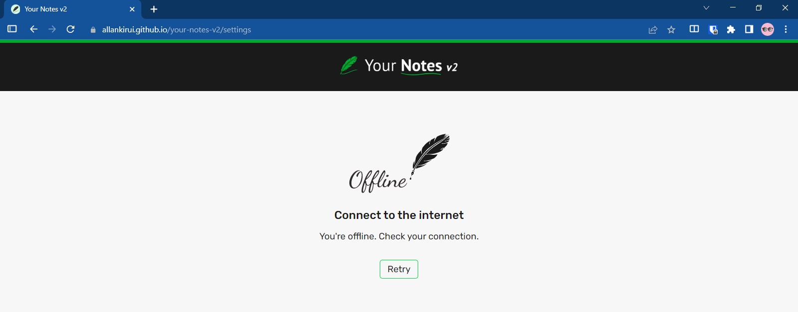
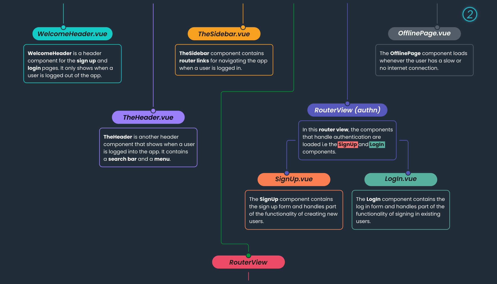

# Your Notes v2

This is a challenge I designed to help me practice my skills with the [VueJS](https://v3.vuejs.org) framework.

<!-- Note that the Table of contents links don't work offline because
    of the use of emojis. They do however work online on GitHub

    https://github.com/thlorenz/anchor-markdown-header/issues/36
-->

## Table of contents 📖

- [Overview](#overview-)
  - [About the challenge](#about-the-challenge-)
  - [Screenshots](#screenshots-)
  - [Links](#links-)
  - [Quickstart guide](#quickstart-guide-)
- [My process](#my-process-gear)
  - [Built with](#built-with-hammer_and_wrench-pencil-triangular_ruler)
  - [What I learned](#what-i-learned-)
  - [Continued development](#continued-development-stopwatch)
  - [Useful resources](#useful-resources-)
- [Author](#author-)

## Overview 🔎

---

### About the challenge ❔

The challenge aims to test the developer's skill in:

- state management with `vuex`
- handling user authentication with Firebase's Authentication service
- handling storage of user data with Firebase's Cloud Firestore
- implementing elements of progressive web applications
- handling transitions the Vue way with the `transition` and `transition-group` components

<br/>

### Screenshots 📷

---


Screenshot of the **included** design file.

- It shows a general view of the page designs.

---

<br/>


Screenshot of the **included** design file.

- It shows the full view of the page designs.

---

<br/>


Screenshot of the **included** design file.

- It shows page designs for the _purplish_ and _bluetiful_ themes.

---

<br/>


Screenshot of the **included** design file.

- It shows the design for the **Notes** page with a note selected for viewing.

---

<br/>


Screenshot of the **included** design file.

- It shows the design for the **Todos** page with a todo selected for viewing.
- It also shows some of the attached functionality for todo tasks.

---

<br/>


Screenshot of the **included** design file.

- It shows the design for the **Todos** page with the _purplish_ theme selected.
- It also shows a todo task that has been opened for editing.

---

<br/>


Screenshot of the **included** design file.

- It shows the design for the **Todos** page with the _bluetiful_ theme selected (_Psst! This happens to be my favorite theme_ 😉).
- It also shows a welcome todo that contains some useful tips.

---

<br/>


Screenshot of the **Todos** page running on my **local development server**.

- It shows the loading screen while user data is being fetched.

---

<br/>


Screenshot of the **Notes** page running on my **local development server**.

- It shows the sidebar minified as part of the responsive nature of the page.
- It also shows how the sidebar uses custom tooltips for a better user experience (_bottom-left_).

---

<br/>


Screenshots of the **Notes** page running on my **local development server**.

- It shows the how the notes page looks on small screens.
- It also shows a modal for creating a new note.

---

<br/>


Screenshot of the **Notes** page running on my **local development server**.

- It shows one of the many notifications that are available (_bottom-left_). The current notification shows up when a user deletes a note or a todo. I thought it would be funny to include [textfaces](https://textfac.es) and the textface on this particular notification looks like someone's throwing out something 😄

---

<br/>


Screenshot of the **Notes** page running on my **local development server**.

- Who said you can't have fun while programming? This particular screenshot shows one of the errors that might occur when trying to communicate with **Firestore**. However, it is highly unlikely that a user will ever experience this type of error, unless they are dabbling in the **source code**. Hence, why I dubbed the error an '**_Epic Bug_**' 😅

---

<br/>


Screenshot of the **Todos** page running on my **local development server**.

- I wanted to add something special for users of **Your Notes v2** - Any user that signs up to the site with an **Email** and **Password** gets to have a really cool, randomly generated **avatar** for their profile (_top-right_).
- As for user's who choose to sign up with **Google**, the profile photo from their Google account, if any, would be used instead. However, if they haven't set any profile photo, they too would get an **avatar** generated for them. #MadeWith🧡

---

<br/>



Screenshot of the **OfflinePage**.

- It shows how the offline page looks when it shows up due to low or no Internet connectivity. It also follows the user's preferred theme.

---

<br/>





Screenshots of the **App Tree**.

- They show an overview of the components, how they relate to each other and also describes some of the attached functionality.

---

<br/>


Screenshots of the **Vuex Tree**.

- They show an overview of the **vuex stores** i.e. the **root store** and the **store modules**.

---

<br/>


Screenshot of the **Firestore Structure**.

- It shows how the backend in **Firebase's Cloud Firestore** is structured i.e. the various Firestore **collections**, **document IDs** and **document fields**.

<br/>

### Links 🔗

- Live Site URL: [Your Notes v2](https://allankirui.github.io/your-notes-v2/)

<br/>

### Quickstart guide 📜

To run the code, you need to follow these steps:

1. Clone or download the repository to your computer.
2. You might need to install [Node.js](https://nodejs.org/) for the following steps.
3. Open a terminal window and navigate to the directory containing the repository.
4. Run `npm install` in the terminal to install required dependencies (This will create a **node_modules** folder.)
5. Run `npm run serve` to bring up the development server. You can view the app at **localhost:8080**
   (or whichever port is shown in your terminal).

<br/>

## My process :gear:

---

Since **Your Notes v2** is an updated version of [Your Notes](https://github.com/AllanKirui/YourNotes/), I already knew that I wanted to make a to-do/notes app. I looked over the features of the original version of the app and wrote down all the things that I could improve upon.

With the list in hand, I began the design process, coming up with wireframes and adding details such as colors, layouts and typography to the designs. After the initial design phase, I finally came up with a passable design.

Having captured most of my ideas about the app, I initialized the Vue app and started meeting the design requirements one line of code at a time. 🏁

<br/>

### Built with :hammer_and_wrench: :pencil: :triangular_ruler:

- HTML5
- CSS Flexbox
- CSS Grid
- [Vue](https://v3.vuejs.org) - The Progressive JavaScript Framework
- [Inkscape](https://inkscape.org) - Open Source Scalable Vector Graphics Editor
- [Firebase](https://firebase.google.com/) - An app development platform that helps you build and grow apps and games users love.

<br/>

### What I learned 🎓

The time I spent working on this project was a worthwhile way for me to continue practicing my Vue skills. These are some of the things I learned:

- **Vue transitions and animations**

  - I learned how to use Vue's `transition` component to set up transitions and animations that would otherwise be difficult to implement on elements that are conditionally rendered on screen.

  - I also learned how I could animate list items using the `transition-group` component. This was very handy in animating notifications in the app that can at times get stacked up.

  - With the `transition` component, it was also possible to add animations to the components that are loaded through routing. I thought it best to animate only the **SignUp** and **LogIn** pages.

- **Vue slots**

  - Earlier on, I had learnt about `slots`, but I never really found a use case for them like I did in **Your Notes v2**.

- **state management with Vuex**

  - Since I had learnt a bit about **Vuex** at the time I started working on this app, I decided that the app would be a great place to manage global application wide state with **Vuex**.

- **Firebase integration**

  - I was able to intergrate Firebase into the app (something I had not done in the original version of the app). Once the app was connected to Firebase, I chose to use Firebase's **Cloud Firestore** as my backend solution. I looked through the documentation and other useful resources to learn how I would get up and running with it.

- **progressive web applications**
  - I'm not an expert in PWAs, but through [Ahmad Karimzade's article](https://medium.com/@ahmadkzx/vue-offline-page-fbae11e7c3b7) on creating a Vue offline page, I was able to add simple PWA functionality to **Your Notes v2**.

I'm glad I chose to make an updated version of **Your Notes**. I was able to add many of the lacking features from the original version. **Your Notes v2** features a better UI/UX experience, improved code architecture, Firebase integration, and everything I've learnt since making the original version ☺️

<br/>

**Here's some of the code that I'm proud of** 😎

I'm proud of the entire app, but here's one honorable mention.

Using the `transition-group` component to animate list items for the notifications.

It renders an unorderered list and within it. It then loops through _notification items_ in the _notificationQueue_ creating list items, adjusting the position of each _notification item_ if there are multiple.

```html
<transition-group tag="ul" name="notification">
  <li
    class="notification-item"
    v-for="(notification, index) in notificationQueue"
    :key="index"
    :style="`position: absolute; bottom: ${index * 50}px`"
  >
    <base-card :mode="cardStyle">
      <p class="message">{{ notification.message }}</p>
    </base-card>
  </li>
</transition-group>
```

<br/>

### Continued development :stopwatch:

Going forward, I want to continue learning more about frontend development and to practice what I already know by tackling more projects built with **Vue**. Applying the features and best practices that I've learned from working on this project.

<br>

### Useful resources 💎

- [Medium](https://medium.com/@ahmadkzx/vue-offline-page-fbae11e7c3b7) - Vue Offline Page by **Ahmad Karimzade**

- [Web AIM contrast checker](https://webaim.org/resources/contrastchecker/) - Web accessibility in mind

- [Forge icons](https://icons.theforgesmith.com/) - 300+ right mix of SVG icons for your project.

- [CSS box-shadows](https://getcssscan.com/css-box-shadow-examples) - Beautiful CSS box-shadows

- [Flat UI colors](https://flatuicolors.com/) - 280 handpicked colors

- [Text faces](https://textfac.es/)

- [Firebase](https://firebase.google.com/) - An app development platform that helps you build and grow apps and games users love.

- [EmailJS](https://www.emailjs.com/) - Send email directly from your code. No server code needed. Focus on things that matter!

- [DiceBear avatars](https://avatars.dicebear.com/) - Avatar library for designers and developers.

- [unDraw](https://undraw.co/) - Open-source illustrations for any idea you can imagine and create.

- [Inkscape](https://inkscape.org) - Inkscape SVG Editor. I use it all the time when I'm working on any web project. After designing the project, I used Inkscape's in-built tools to help me figure out the _spacing_, _sizing_ and _positioning_ of elements throughout the project. To better understand how I approached coding the project using Inkscape, have a look at this repository I made - [Designing and Coding Layouts](https://github.com/AllanKirui/designing-and-coding-layouts)

<br>

---

## Author ✍🏾

- Github - [Allan Kirui](https://www.github.com/AllanKirui)
- Email - <allan.kirui@outlook.com>

Thank you for taking your time to go through this readme.

If you do encounter any _undocumented features_ a.k.a bugs, kindly let me know 😉

## ✌️

[Back to top](#your-notes-v2)
